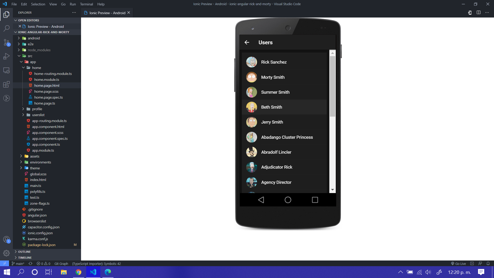
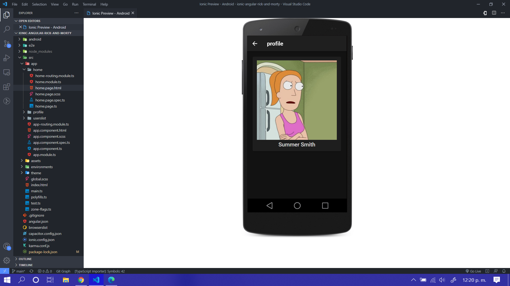
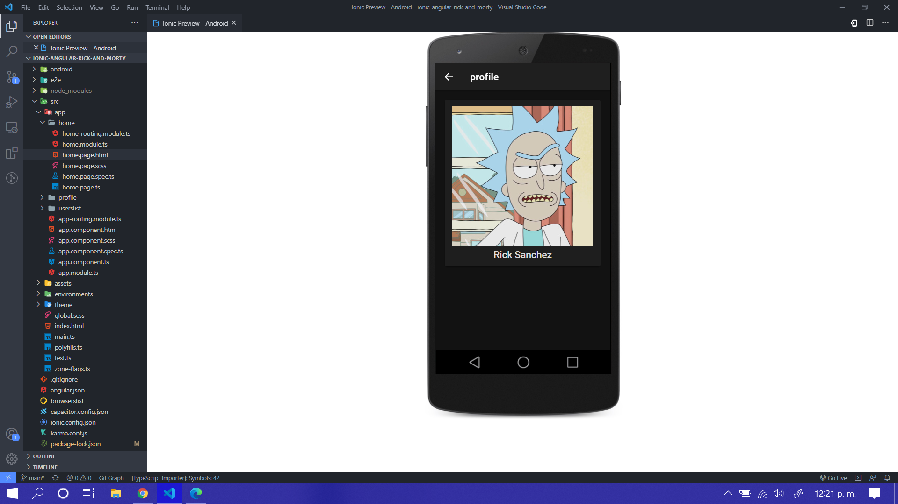

# manejoAPI-Rick-Morty en Ionic y Angular

## interfaz

## Modulos

* angular 
* ionic 

## instalar el proyecto 

* previamente tener instalado npm, angular y ionic
* instalar dependencias con ## npm i
* correr el proyecto en la terminal con el comando 

# ionic serve

* aplicacion hibrida (Ios, Android, WindowsPhone)